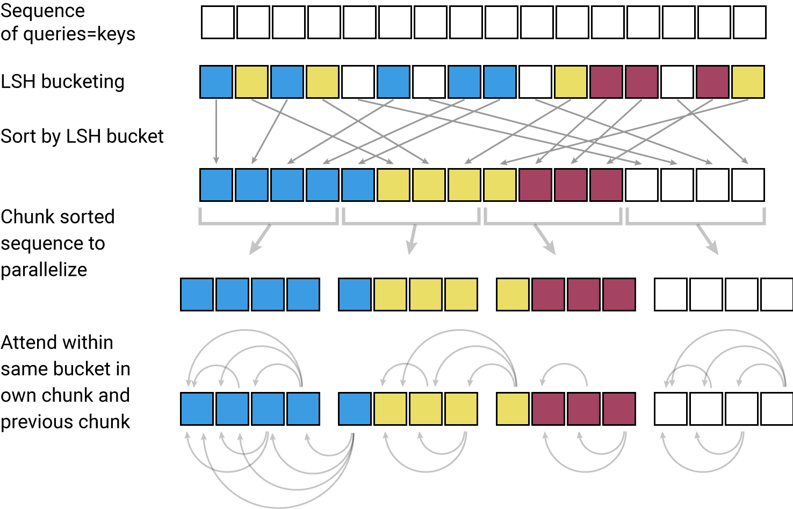

# Text-Generation-using-Reformer
Natural Language Generation using Reformer is a Transformer model for longer sequences, The project aim at generating text using a sample of text, In this I am using Reformer to overcome the token limit of BERT, ALBERT, ELECTRA as these all models donot support longer sequences due to their short token limit.

  

